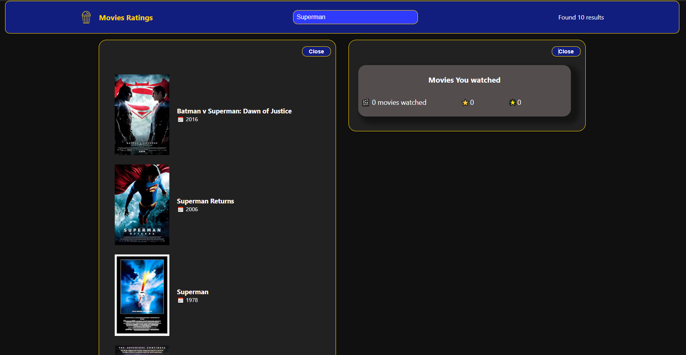
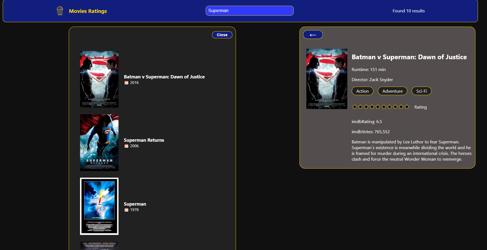
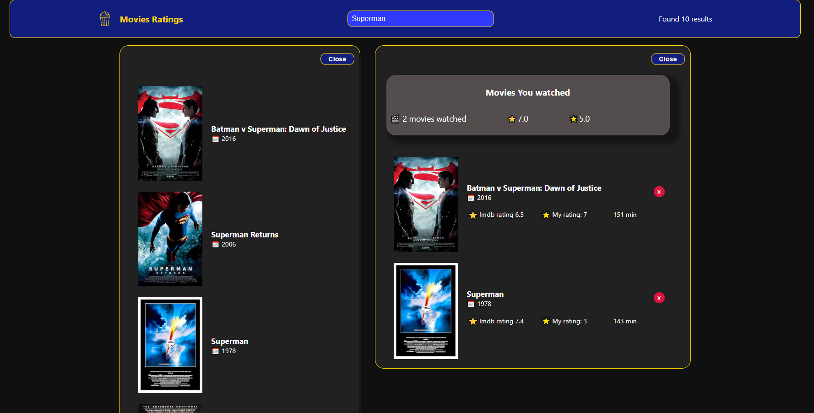

The application is currently in development. The next step is to optimize it for mobile devices, and there may also be some minor adjustments along the way.


## Demo:[🎬 Movie Finder App](https://movie-ratings-two.vercel.app/)

````markdown
A React-based movie search application that allows users to search for movies using the OMDb API.
Users can rate and add movies to a watched list, and calculate the average IMDb rating of the movies in their watched list.

---

## 🚀 Table of Contents

1. [Features](#features)
2. [Used Technologies](#used-technologies)
3. [Installation](#installation)
4. [Environment Variables](#environment-variables)
5. [How It Works](#how-it-works)
6. [Screenshots](#screenshots)

---

## ✨ Features

- **Search** for movies by title.
- View movie details including IMDb rating, runtime, and genre.
- **Rate movies** with stars and add them to the **watched list**.
- Calculate and display the **average IMDb rating** for movies in the watched list.
- Responsive UI built with **React** and **styled-components**.

---

## 🛠️ Used Technologies

| **Tool/Technology**       | **Description**                                             |
| ------------------------- | ----------------------------------------------------------- |
| **React**                 | JavaScript library for building user interfaces.            |
| **Vercel**                | Cloud platform for static site deployment and hosting.      |
| **OMDb API**              | API used for retrieving movie data based on search queries. |
| **Styled-components**     | CSS-in-JS solution for styling React components.            |
| **React Hooks**           | Used for managing state and lifecycle events.               |
| **Environment Variables** | Used to store the API key securely during deployment.       |

---

## 📦 Installation

1. Clone the repository:

   ```bash
   git clone https://github.com/yourusername/movie-finder-app.git
   ```
````

2. Navigate to the project directory:

   ```bash
   cd movie-finder-app
   ```

3. Install the required dependencies:

   ```bash
   npm install
   ```

4. Start the development server:

   ```bash
   npm start
   ```

Your app will be running on [http://localhost:3000](http://localhost:3000).

---

## 🔑 Environment Variables

To keep sensitive information secure, the API key for the OMDb API is stored in environment variables.

1. Create a `.env` file in the root directory of the project.
2. Add the following line to store your API key:

   ```env
   REACT_APP_OMDB_API_KEY=your-api-key-here
   ```

3. Make sure you don't commit the `.env` file by adding it to `.gitignore`.

For deployment on **Vercel**, set the `REACT_APP_OMDB_API_KEY` environment variable in your Vercel project settings under **Environment Variables**.

---

## ⚙️ How It Works

1. **Movie Search**: The app allows users to search for movies by title. It fetches data from the OMDb API.
2. **Movie Details**: Clicking on a movie shows more details such as runtime, genre, director, and IMDb rating.
3. **Add to Watched**: Users can rate movies using stars, and if the rating is set, they can add the movie to their "watched list".
4. **Average Rating**: The app calculates the average IMDb rating for all movies in the "watched list".

---

## 🖼️ Screenshots

Below are some screenshots of the app in action.

### Main Search Page

<div style="text-align: center;">
<div style="text-align: center;">
  
</div>

### Movie Details Page

<div style="text-align: center;">
  
</div>

### Watched Movies List

<div style="text-align: center;">
  
</div>
</div>
---
